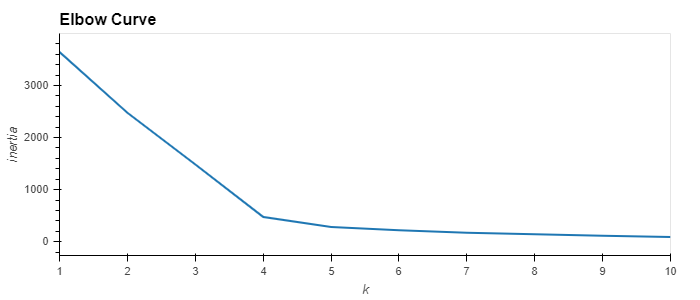
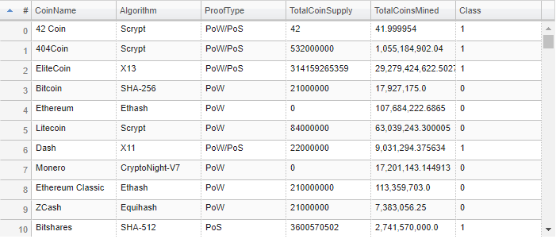
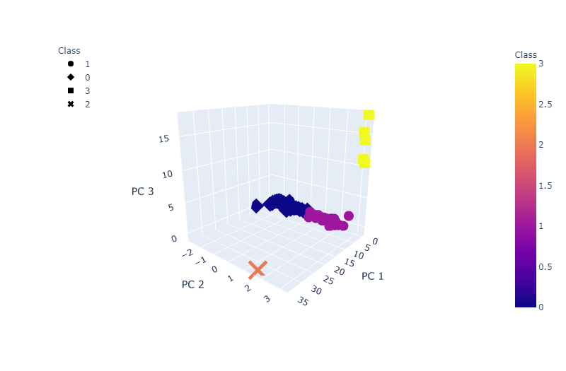
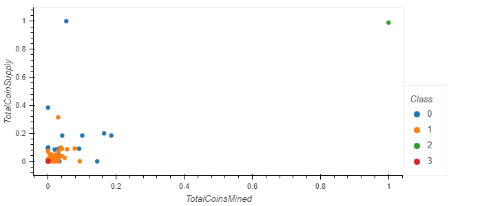

# DABC-Cryptocurrencies

## Overview

The purpose of this repository is to utilize Unsupervised Machine Learning to classify a list of cryptocurrencies on the trading market into a number of classes based on each cryptocurrency's characteristics: Algorithm, Proof Type, Total Coines Mined, and Total Coin Supply. Each class of cryptocurrency can then be marketed to investors as different options to form an investment portfolio.

## Data Source:

https://min-api.cryptocompare.com/data/all/coinlist

## Analysis:

1. Cryptocurrency data is first imported into Jupyter Notebook as a dataframe.

2. The data is then cleaned to filter for cryptocurrencies that are being traded, with a working algorithm, with coins being mined, and do not have any null values in any of the columns.

3. The data is then transformed into number based variables by using the get_dummies() function and scaled with the StandardizedScaler() function.

4. The data is then reduced to 3 principal components by using PCA.

5. Next, an Elbow Curve is created to find the best value for K (number of clusters) in the K-Means model. Based on the results, K=4 was the best value to use.

</img>

6. A K-Means Model with 4 clusters is utilized to fit the data and predict the class for each cryptocurrency. Below is the first 10 rows of the resulting table:

</img>

7. A 3D plot is created to visualize the 4 clusters ideintified by the K-Means model.

</img>

8. Total Coin Supply and Total Coin Mined are further scaled between 0 and 1 with the MinMaxScaler() and plotted as scatter plot, with each class differentiated by color

</img>